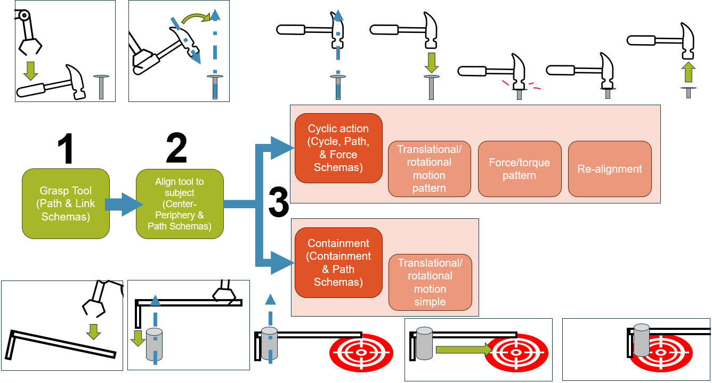
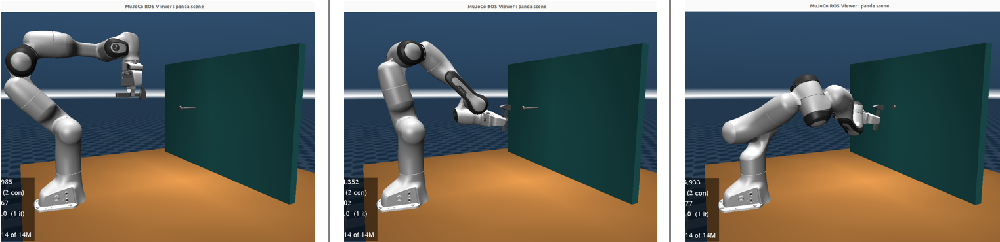
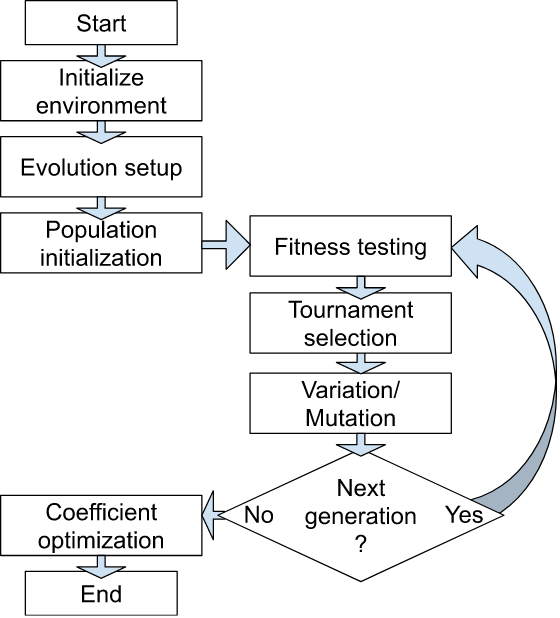
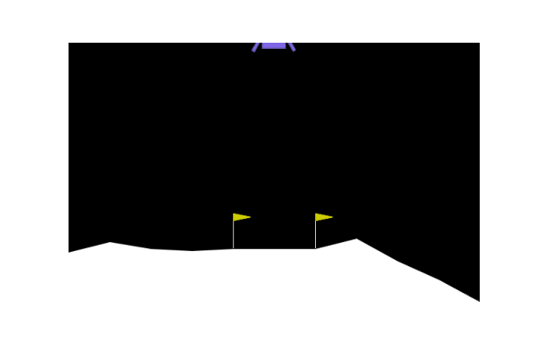
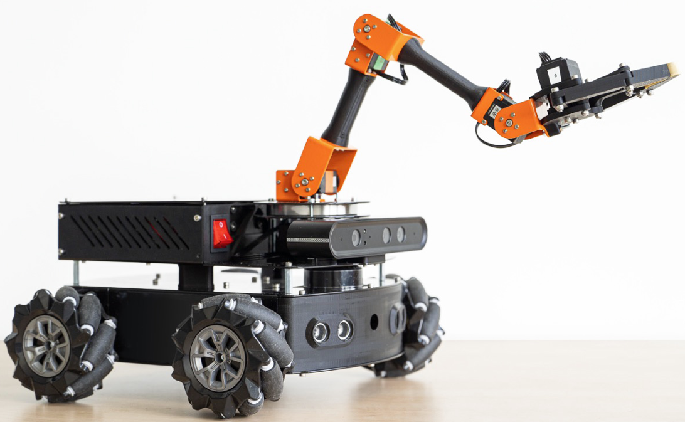
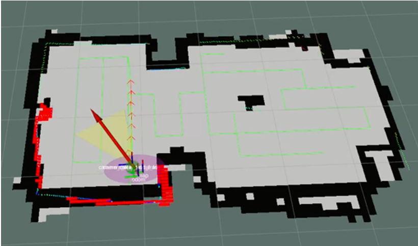
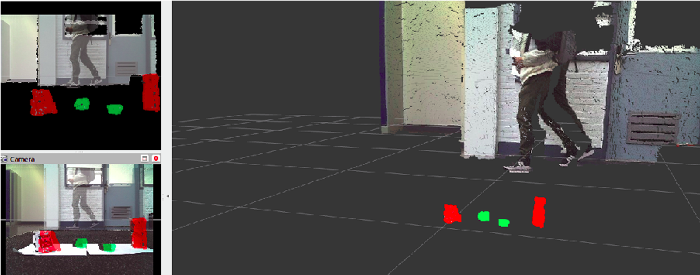
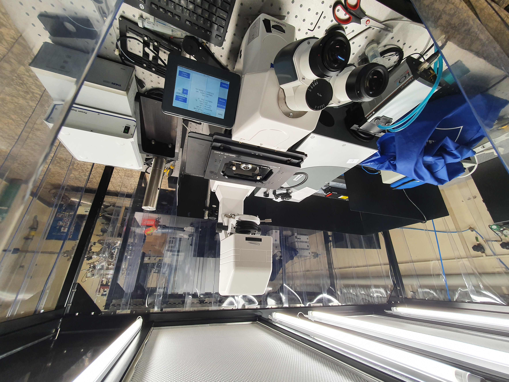
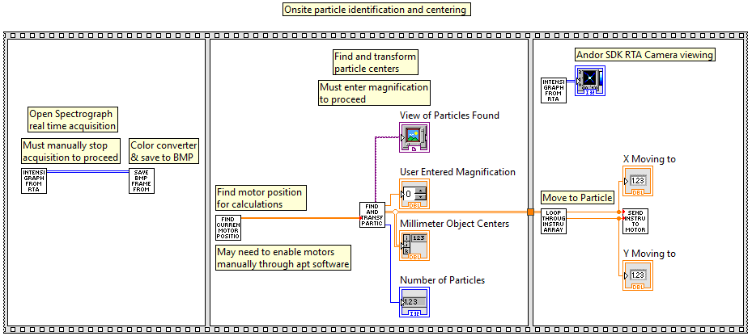

## Master Thesis

### Robotic Tool Use with Image Schema

My master's thesis bridged the gap between high-level task planning and low-level motion planning for robotic tool use with a focus on cyclic (repeated motion) tool use.

An existing PDDL system generated step-by-step plans describing the actions a robot should perform. I designed and implemented the intermediate planning layer that translated these actions into finer-grained robot actions and observable elements that could guide and evaluate motion execution. This was accomplished using image schema, a theory from cognitive linguistics that describes the way humans understand abstract concepts through spatio-temporal phenomena.

**My contributions:**
- Designed the task-to-motion planning approach
- Developed Python/ROS2 nodes to parse PDDL plans
- Translated high-level tool-use actions into executable robot actions
- Defined observable features for evaluating action outcomes
- Implemented feedback to determine whether actions should be repeated
- Developed a simulation environment for testing and evaluation

**Technologies:** `Python` · `ROS2` · `PDDL` · `Motion Planning` · `Simulation`

<figure>
  
  <figcaption>
    Overview of how the high-level plan (grasp, align, cycle or contain) is represented through Image Schema.
  </figcaption>
</figure>

<figure>
  <video controls width="800">
    <source src="images/panda_align.mp4" type="video/mp4">
  </video>
  <figcaption>
    Simulation of Franka Emika Panda robot aligning hammer to nail.
  </figcaption>
</figure>
<figure>
  <video controls width="800">
    <source src="images/panda_cycle.mp4" type="video/mp4">
  </video>
  <figcaption>
    Simulation of Franka Emika Panda robot stiking the nail with a hammer and evaluating if another strike should occur or if goal has been reached.
  </figcaption>
</figure>

<figure>
  
  <figcaption>
    Simulation showing ready, aligned, and completion steps with different nail orientation, demonstrating generalizability.
  </figcaption>
</figure>

---

## Evolutionary Algorithms

### Lunar Lander Improvements

In this project, I designed improvements to a hybrid Reinforcement Learning and Genetic Programming solution to the Gymnasium Lunar Lander environment including elitism and neural-guided population initialization.

The environment has a lander that must land on a surface using four actions: move up, move left, move right, and do nothing. These four actions make up a multitree of functions, data features, and constants that chose the best action with argmax. A population of multitree structures are generated, their fitness evaluated, and mutation carried out a specified number of times to automatically generate the best solution to the lunar lander.

**My contributions:**
- Given Reinforcement learning and genetic programming solution, researched and implemented possible improvements
- Added elitism to preserve best solutions and prevent degredation across generations
- Updated population initialization with Deep Q-Networks to learn a policy to generate high fitness multitrees

**Technologies:** `Python` · `Evolutionary Algorithms` · `Genetic Programming` · `Reinforcement Learning`

<figure>
  
  <figcaption>
    Baseline flowchart showing the steps of initialization and the steps of each generation.
  </figcaption>
</figure>

<figure>
  
  <figcaption>
    The top result from a solution with a population size of 256 and 10 generations.
  </figcaption>
</figure>

---

## Multidisciplinary Project

### Autonomous Manure Removal with a MIRTE Master Robot

As part of a multidisciplinary team, I developed a system on the MIRTE Master robot for removing manure from a cow barn.

My main contribution was integrating a boustrophedon coverage path-planning approach to generate paths for the robot to follow while cleaning. I also contributed to the broader system design and integration with the team's robot software.

**My contributions:**
- Integrated the boustrophedon path-generation algorithm
- Generated coverage paths for the cleaning area
- Integrated the path planner with the robot's navigation system
- Contributed to system design and testing

**Technologies:** `Python` · `ROS` · `Path Planning` · `MIRTE Master`

<figure>
  
  <figcaption>
    MIRTE Master robot
  </figcaption>
</figure>

<figure>
  
  <figcaption>
    Generated Boustrophedon cleaning path
  </figcaption>
</figure>

<figure>
  
  <figcaption>
    Robot detecting targets (green) and obstacles (red) with point cloud clusters
  </figcaption>
</figure>

---

## Bachelor Thesis

### Automated Nanoparticle Detection and Positioning

For my bachelor's thesis, I developed a LabVIEW-based system to automatically detect nanoparticles under a microscope and position them at the center of the field of view so dark-field scattering spectra can be taken.

The system combined image processing with control of a motorized stage, allowing nanoparticles to be automatically located and centered.

**My contributions:**
- Developed the nanoparticle detection algorithm using image thresholding
- Calculated the required stage movement by converting camera pixels to millimeters
- Sent required motion to the stage controller to center particles

**Technologies:** `LabVIEW` · `Computer Vision` · `Image Processing` · `Motion Control`

<figure>
  
  <figcaption>
    Laboratory setting with microscope, motorized stage, and spectrometer
  </figcaption>
</figure>

<figure>
  
  <figcaption>
    Simplified version of workflow for particle detection and centering
  </figcaption>
</figure>

<figure>
  <video controls width="800">
    <source src="images/find_center_particle.mp4" type="video/mp4">
  </video>
  <figcaption>
    Real time detection and centering of a gold nanoparticle under the microscope
  </figcaption>
</figure>